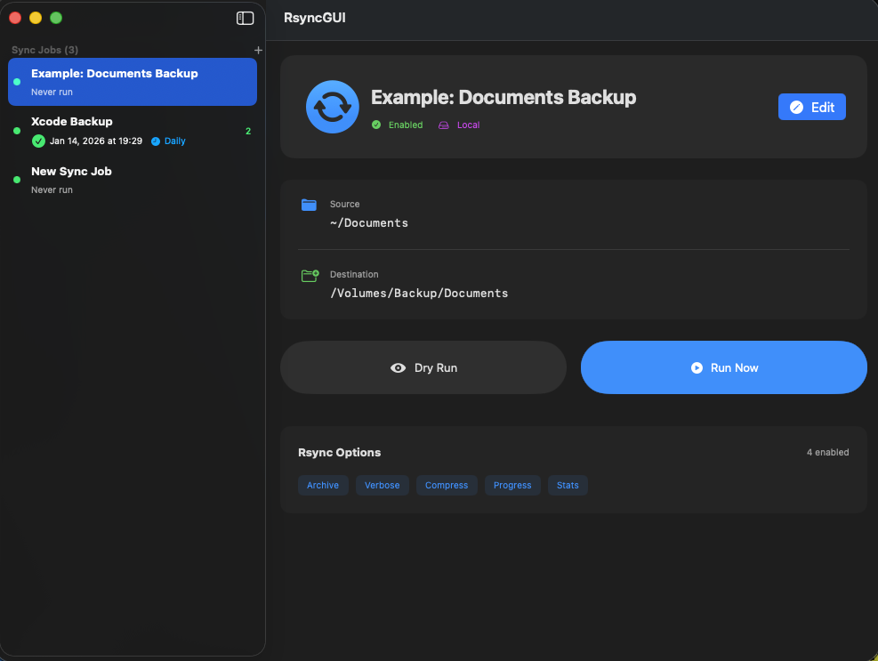
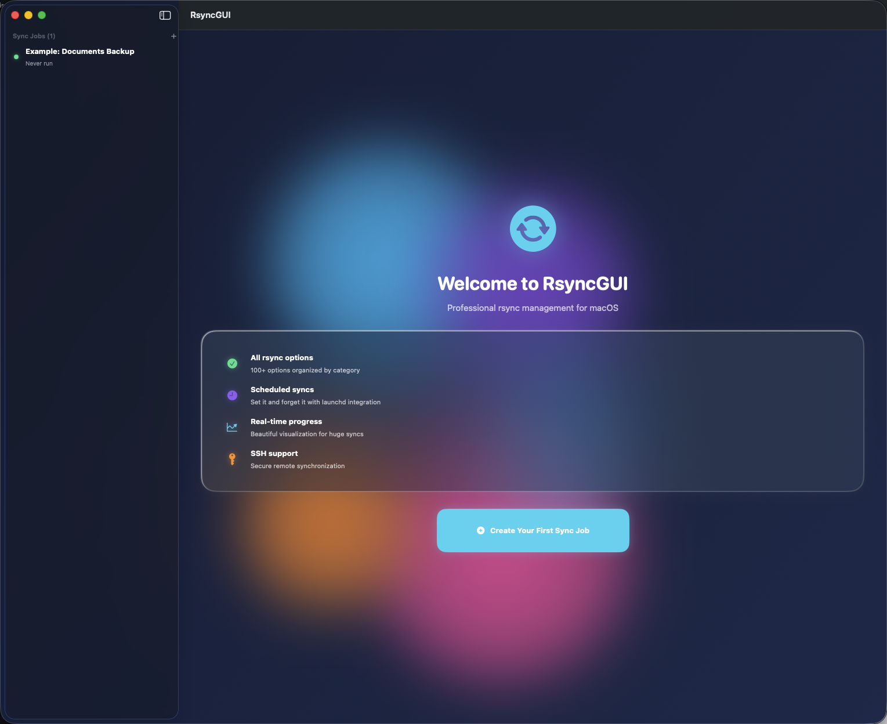

# RsyncGUI v1.6.0


<p align="center">
  
  
  
</p>

**Professional rsync GUI for macOS** - Beautiful, comprehensive, and powerful file synchronization with AI-powered insights.

A modern, open-source alternative to the discontinued [RsyncOSX](https://github.com/rsyncOSX/RsyncOSX).





---

## Download

Download the latest release: [RsyncGUI v1.6.0](https://github.com/kochj23/RsyncGUI/releases/latest)

Or build from source (see below).

---

## Migrating from RsyncOSX?

If you're coming from RsyncOSX (discontinued), RsyncGUI offers:
- Modern SwiftUI interface with glassmorphic design
- Real-time transfer progress with speed and ETA
- Native Apple Silicon support
- Active development and maintenance
- Free and open source (MIT License)

---

## 🆕 What's New in v1.6.0 (February 2026)

### 🔲 macOS Desktop Widget
**Monitor your backups at a glance from your desktop:**

- **Three Widget Sizes**: Small, Medium, and Large widgets for Notification Center
- **Backup Health Score**: Visual health grade (A-F) with percentage score
- **Last Sync Status**: See when your last sync ran and its result
- **Next Scheduled Sync**: Know when your next backup will run
- **Jobs with Errors**: Quick view of any jobs that need attention
- **Recent Activity**: Track your most recent sync operations (Large widget)

**Widget Features:**
- Real-time updates after each sync operation
- Auto-refresh every 15 minutes
- Color-coded status indicators (green=success, red=failed, orange=partial)
- Tap widget to open RsyncGUI app

**Adding the Widget:**
1. Right-click on your desktop
2. Select "Edit Widgets..."
3. Search for "RsyncGUI"
4. Drag your preferred size to the desktop

---

## What's New in v1.5.0 (February 2026)

### 🧠 AI-Powered Insights Dashboard
**10 intelligent features to help manage your backups:**

1. **Smart Error Diagnosis** - Analyzes rsync errors and provides actionable fixes with specific commands
2. **Change Summary** - Human-readable summaries of sync operations ("Added 50 photos, Updated 10 documents")
3. **Anomaly Detection** - Detects ransomware patterns, mass deletions, and unusual file activity
4. **Smart Scheduling** - Analyzes your sync history to recommend optimal backup times
5. **Storage Prediction** - Predicts when destination drives will run out of space
6. **Intelligent Exclusions** - Suggests files/folders to exclude (node_modules, DerivedData, etc.)
7. **Natural Language Job Creation** - Create jobs by describing them in plain English ("Backup my documents to iCloud daily")
8. **Backup Health Score** - Overall grade (A-F) with detailed metrics for coverage, frequency, redundancy
9. **Recovery Assistant** - Search your backup history to find and recover specific files
10. **Sensitive File Detection** - Warns about credentials, SSH keys, API keys, and other secrets

**Access AI Insights from the sidebar:**
- Click "AI Insights" in the sidebar
- View your Backup Health Score with recommendations
- Create jobs using natural language
- Scan for security risks before syncing

### 🔀 Multiple Sources & Destinations
- **Fan-out**: Sync one source to multiple destinations (backup)
- **Fan-in**: Sync multiple sources to one destination (consolidate)
- **Full Mesh**: Sync all sources to all destinations
- **Parallel Execution**: Run syncs simultaneously for speed
- **Pre/Post Scripts**: Run custom scripts before and after syncs

---

## 📋 What's New in v1.1.0 (January 2026)

### ☁️ iCloud Drive Support
**Sync directly to iCloud Drive with one click:**

- **Native Integration**: iCloud Drive as a destination option
- **One-Click Setup**: Button to select iCloud Drive root folder
- **Path Validation**: Automatic verification that iCloud Drive is enabled
- **Seamless Sync**: Rsync handles iCloud Drive like any local folder
- **Auto-Detection**: Validates iCloud Drive availability before sync

**Usage:**
1. Create new sync job
2. Select "iCloud Drive" as destination type
3. Click "iCloud Drive" button to set root folder
4. Or specify subfolder: `~/Library/Mobile Documents/com~apple~CloudDocs/Backups`
5. Run sync—files automatically sync to iCloud

**Benefits:**
- Automatic cloud backup with rsync reliability
- Files available on all your Macs and iOS devices
- No additional cloud service needed (included with iCloud)
- Use existing iCloud storage quota

---

## ✨ Features

### 🎨 Beautiful Progress Visualization
- Stunning animated progress display optimized for **huge syncs** (millions of files)
- Real-time statistics: speed, ETA, files transferred, data transferred
- Smooth animations and gradient effects
- Current file display

### ⚙️ Complete Rsync Support
- **100+ rsync options** organized into intuitive categories
- All transfer, preserve, filter, and advanced options
- Visual organization: Basic, Transfer, Preserve, Filters, Advanced, Schedule tabs

### 📅 Automated Scheduling
- **launchd integration** - runs even when app is closed
- Frequencies: Hourly, Daily, Weekly, Monthly, Custom cron
- Run at system startup option
- Native macOS scheduling

### 🔐 SSH & Remote Support
- SSH authentication with public key support
- Secure credential storage (macOS Keychain)
- Remote-to-local, local-to-remote, remote-to-remote syncs
- Connection testing

### ☁️ iCloud Drive Integration (v1.1.0)
- **Native iCloud Drive destination** - Sync directly to iCloud
- **One-click setup** - Button to select iCloud Drive root
- **Path validation** - Ensures iCloud Drive is enabled and accessible
- **Automatic sync** - Files available on all your devices
- **No extra cost** - Uses your existing iCloud storage

### 🧠 AI-Powered Insights (v1.5.0)
- **Backup Health Score** - Overall grade with detailed recommendations
- **Smart Error Diagnosis** - Understand and fix rsync errors
- **Anomaly Detection** - Ransomware, mass deletion alerts
- **Natural Language Jobs** - Create jobs by describing them
- **Storage Prediction** - Know when drives will fill up
- **Sensitive File Scanner** - Find credentials before backing up
- **Intelligent Exclusions** - Smart suggestions for files to skip
- **Recovery Search** - Find files in your backup history

### 🔲 Desktop Widget (v1.6.0)
- **macOS Widget** - Monitor backups from Notification Center
- **Three sizes** - Small, Medium, and Large widgets
- **Health Score** - Visual backup health at a glance
- **Status Display** - Last sync, next scheduled, errors
- **Recent Activity** - Track recent operations (Large)

### 🔀 Multi-Source/Destination (v1.5.0)
- **Multiple sources** - Sync from multiple folders
- **Multiple destinations** - Backup to multiple locations
- **Sync modes** - Fan-out, Fan-in, Full Mesh
- **Parallel execution** - Faster backups to multiple destinations
- **Pre/Post scripts** - Custom automation

### 💾 Job Management
- Save unlimited sync jobs
- Duplicate jobs for quick setup
- Job statistics tracking
- Enable/disable jobs
- Persistent storage

### 🧪 Dry Run Mode
- Preview changes before executing
- See what will be transferred, deleted, or updated
- Risk-free testing

---

## 📸 Screenshots

### Main Window
Beautiful job management with sidebar navigation and detailed job view.

### Progress View
Stunning real-time progress visualization for huge syncs:
- Animated gradient progress circle
- Real-time transfer statistics
- Speed and ETA display
- Current file indicator

### Job Editor
Comprehensive rsync option editor with organized tabs:
- Basic configuration
- Transfer options
- Preserve attributes
- Filter patterns
- Advanced settings
- Schedule configuration

---

## 🚀 Getting Started

### Installation

1. **Download:** Get the latest release from [Releases](https://github.com/kochj23/RsyncGUI/releases)
2. **Install:** Drag RsyncGUI.app to your Applications folder
3. **Launch:** Open RsyncGUI from Applications

### Quick Start

1. **Create a Job:**
   - Click "+" to create new sync job
   - Name your job
   - Set source path (can use ~ for home directory)
   - Set destination path
   - Configure rsync options

2. **Run the Job:**
   - Click "Dry Run" to preview (recommended)
   - Click "Run Now" to execute
   - Watch beautiful progress visualization

3. **Schedule (Optional):**
   - Go to Schedule tab
   - Enable scheduling
   - Select frequency and time
   - Save job

---

## 📖 Usage Examples

### Example 1: Daily Documents Backup
```
Name: Daily Documents Backup
Source: ~/Documents
Destination: /Volumes/Backup/Documents
Options:
  ✓ Archive mode (-a)
  ✓ Verbose (-v)
  ✓ Compress (-z)
  ✓ Delete extraneous (--delete)
  ✓ Progress (--progress)
Schedule: Daily at 2:00 AM
```

### Example 2: iCloud Drive Backup (v1.1.0)
```
Name: Photos to iCloud
Source: ~/Pictures/Photos
Destination: iCloud Drive (click "iCloud Drive" button)
Destination Type: iCloud Drive
Options:
  ✓ Archive mode (-a)
  ✓ Verbose (-v)
  ✓ Progress (--progress)
Schedule: Daily at 11:00 PM

Benefits:
- Files automatically available on all Macs
- Accessible from iPhone/iPad
- Built-in versioning via iCloud
- No additional cloud service needed
```

### Example 3: Remote Server Sync
```
Name: Web Server Backup
Source: user@server.com:/var/www/html
Destination: ~/Backups/WebServer
Destination Type: Remote Server (SSH)
SSH Key: ~/.ssh/id_rsa
Options:
  ✓ Archive mode (-a)
  ✓ Compress (-z)
  ✓ Partial (--partial)
Schedule: Hourly
```

### Example 3: Photo Archive
```
Name: Photo Library Sync
Source: ~/Pictures
Destination: /Volumes/NAS/Photos
Options:
  ✓ Archive mode (-a)
  ✓ Verbose (-v)
  ✗ Compress (local sync, not needed)
  Exclude: *.tmp, .DS_Store, Thumbs.db
Schedule: Weekly (Sunday 3:00 AM)
```

---

## 🛠️ Building from Source

### Requirements:
- Xcode 15.0+
- macOS 13.0+ deployment target
- Swift 5.9+

### Build Steps:
```bash
git clone https://github.com/kochj23/RsyncGUI.git
cd RsyncGUI
open RsyncGUI.xcodeproj
```

Then build in Xcode (⌘B) or from command line:
```bash
xcodebuild -project RsyncGUI.xcodeproj -scheme RsyncGUI -configuration Release build
```

---

## 🗂️ Project Structure

### Models (`Models/`):
- **SyncJob:** Complete job configuration
- **RsyncOptions:** 100+ rsync options with argument generation
- **ScheduleConfig:** Scheduling with launchd plist generation
- **ExecutionResult:** Statistics and results tracking

### Services (`Services/`):
- **JobManager:** Job CRUD, execution, persistence
- **RsyncExecutor:** rsync command execution and real-time parsing
- **ScheduleManager:** launchd integration and schedule management
- **AIInsightsService:** AI-powered analysis, predictions, and recommendations
- **AIBackendManager:** AI backend configuration (local/cloud options)

### Views (`Views/`):
- **ContentView:** Main app container with navigation
- **JobListView:** Sidebar with all jobs
- **JobDetailView:** Job details, statistics, actions
- **JobEditorView:** Comprehensive editor with tabbed interface
- **ProgressView:** Beautiful real-time progress visualization
- **SettingsView:** App preferences and configuration
- **AIInsightsView:** AI-powered insights dashboard with multiple tabs

---

## 🔧 Configuration

### Rsync Options Categories:

#### **Basic:**
- Archive, Verbose, Compress, Delete, Progress, Stats

#### **Transfer:**
- Recursive, Update, Partial, In-place, Remove source files

#### **Preserve:**
- Permissions, Owner, Group, Times, Links, ACLs, Extended attributes

#### **Filters:**
- Exclude/Include patterns, Size filters, CVS exclusions

#### **Advanced:**
- Checksums, Bandwidth limits, Timeouts, Backups, Performance tuning

---

## 📚 Documentation

### Rsync Options Guide:
- **Archive mode (-a):** Equivalent to -rlptgoD (recommended for most backups)
- **Verbose (-v):** Show detailed output
- **Compress (-z):** Compress during transfer (good for remote syncs)
- **Delete (--delete):** Remove files from destination that don't exist in source
- **Partial (--partial):** Keep partially transferred files (resume support)
- **Checksum (-c):** Use checksums instead of time/size (slower but accurate)

### Filter Patterns:
```
*.tmp          # Exclude all .tmp files
.DS_Store      # Exclude macOS metadata
node_modules/  # Exclude entire directories
*.log          # Exclude log files
```

### Schedule Configuration:
- **Hourly:** Runs at minute 0 of every hour
- **Daily:** Runs at specified time every day
- **Weekly:** Runs on specified day at specified time
- **Monthly:** Runs on specified day of month at specified time

---

## 🎯 Use Cases

### Perfect For:
- ✅ **Large backups** (external drives, NAS)
- ✅ **Remote server synchronization** (SSH)
- ✅ **Automated daily/weekly backups**
- ✅ **Photo/video library management**
- ✅ **Development file syncing**
- ✅ **Website deployment**
- ✅ **Mirror creation**
- ✅ **Incremental backups**

### Not Suitable For:
- ❌ Real-time file watching (use other tools)
- ❌ Bi-directional sync (rsync is one-way)
- ❌ Version control (use Git/SVN)

---

## 🆘 Troubleshooting

### Jobs Not Running on Schedule:
1. Check that schedule is enabled in job
2. Verify job is enabled (green dot in sidebar)
3. Check Console.app for launchd errors
4. Look for plist in ~/Library/LaunchAgents/

### SSH Connection Issues:
1. Test SSH manually: `ssh user@host`
2. Verify SSH key path is correct
3. Ensure key has correct permissions (chmod 600)
4. Check ~/.ssh/known_hosts for host entry

### Slow Performance:
1. Disable compression for local syncs
2. Use --whole-file for local syncs
3. Increase block size for large files
4. Reduce bandwidth limit or remove it

### Permission Errors:
1. Check source/destination permissions
2. For owner/group preservation, may need sudo
3. Use --fake-super for non-root privilege preservation

---

## 🔮 Roadmap

### Completed Features:
- [x] ~~Execution history viewer~~ ✅ v1.2.0
- [x] ~~Before/after hook scripts~~ ✅ v1.5.0
- [x] ~~Multi-job parallel execution~~ ✅ v1.5.0
- [x] ~~Exclude pattern library~~ ✅ v1.5.0 (AI suggestions)
- [x] ~~AI-powered insights~~ ✅ v1.5.0

### Planned Features:
- [ ] Job templates library
- [ ] Email notifications
- [ ] Bandwidth usage graphs
- [ ] Conflict resolution UI
- [ ] Menu bar app mode
- [ ] iCloud job sync

---

## 🤝 Contributing

Contributions welcome! Please feel free to submit pull requests or open issues for bugs and feature requests.

### Development:
1. Fork the repository
2. Create a feature branch
3. Make your changes
4. Test thoroughly
5. Submit pull request

---

## 📄 License

MIT License

Copyright (c) 2026 Jordan Koch

Permission is hereby granted, free of charge, to any person obtaining a copy
of this software and associated documentation files (the "Software"), to deal
in the Software without restriction, including without limitation the rights
to use, copy, modify, merge, publish, distribute, sublicense, and/or sell
copies of the Software, and to permit persons to whom the Software is
furnished to do so, subject to the following conditions:

The above copyright notice and this permission notice shall be included in all
copies or substantial portions of the Software.

THE SOFTWARE IS PROVIDED "AS IS", WITHOUT WARRANTY OF ANY KIND, EXPRESS OR
IMPLIED, INCLUDING BUT NOT LIMITED TO THE WARRANTIES OF MERCHANTABILITY,
FITNESS FOR A PARTICULAR PURPOSE AND NONINFRINGEMENT. IN NO EVENT SHALL THE
AUTHORS OR COPYRIGHT HOLDERS BE LIABLE FOR ANY CLAIM, DAMAGES OR OTHER
LIABILITY, WHETHER IN AN ACTION OF CONTRACT, TORT OR OTHERWISE, ARISING FROM,
OUT OF OR IN CONNECTION WITH THE SOFTWARE OR THE USE OR OTHER DEALINGS IN THE
SOFTWARE.

---

## 🌟 Support

If you find RsyncGUI useful, please:
- ⭐ Star the repository
- 🐛 Report bugs via Issues
- 💡 Suggest features
- 📢 Share with others

---

**Built with ❤️ by Jordan Koch**

---

**Last Updated:** February 2, 2026
**Status:** ✅ Production Ready

---

## More Apps by Jordan Koch

| App | Description |
|-----|-------------|
| [DotSync](https://github.com/kochj23/DotSync) | Configuration file synchronization across machines |
| [TopGUI](https://github.com/kochj23/TopGUI) | macOS system monitor with real-time metrics |
| [ExcelExplorer](https://github.com/kochj23/ExcelExplorer) | Native macOS Excel/CSV file viewer |
| [MBox-Explorer](https://github.com/kochj23/MBox-Explorer) | macOS mbox email archive viewer |
| [icon-creator](https://github.com/kochj23/icon-creator) | App icon set generator for all Apple platforms |

> **[View all projects](https://github.com/kochj23?tab=repositories)**

---

> **Disclaimer:** This is a personal project created on my own time. It is not affiliated with, endorsed by, or representative of my employer.
