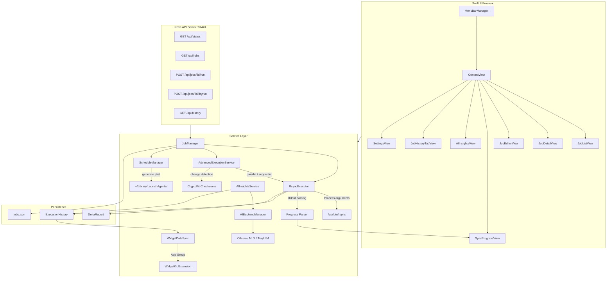
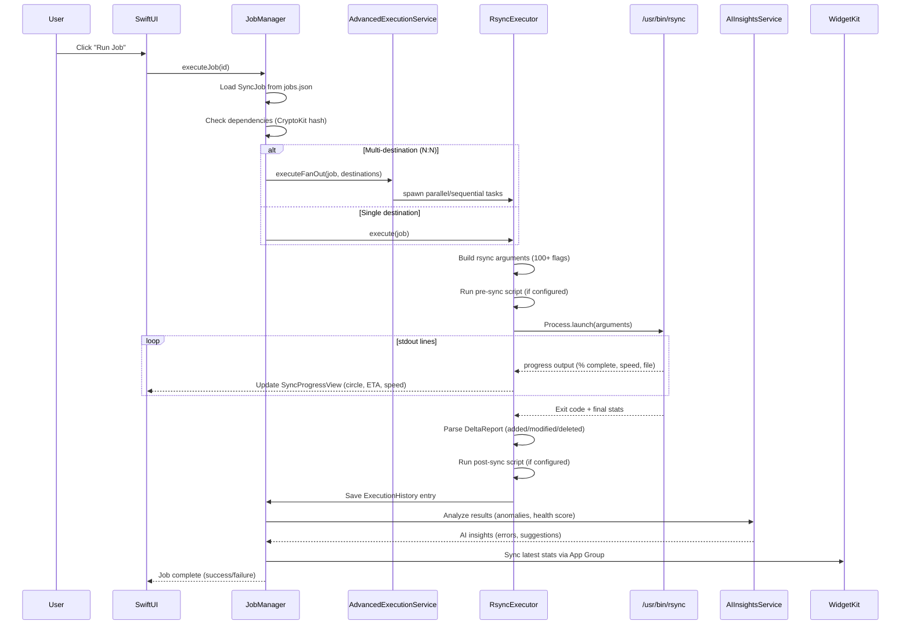

# RsyncGUI

A professional macOS GUI for rsync with real-time progress, AI-powered insights, launchd scheduling, multi-destination sync, desktop widgets, and a local API server.


---

## Features

| Feature | Description |
|---------|-------------|
| 100+ rsync flags | Tabbed visual editor across 14 categories (Basic, Transfer, Preserve, Filters, Comparison, Bandwidth, Output, SSH, Ownership, Backup, Logging, Network, I/O, Checksum) |
| Real-time progress | Animated gradient progress circle with speed, ETA, file count, and current file display |
| Multi-source / multi-destination | Fan-out (1:N), fan-in (N:1), and full mesh (N:N) sync modes with parallel or sequential execution |
| launchd scheduling | Native macOS scheduling (hourly, daily, weekly, monthly, custom cron) that runs even when the app is closed |
| SSH remote sync | Public key authentication with Keychain credential storage, connection testing, and key path validation |
| iCloud Drive sync | One-click iCloud destination setup with automatic `.icloud` placeholder exclusion |
| AI insights (10 features) | Error diagnosis, change summary, anomaly detection, smart scheduling, storage prediction, exclusion suggestions, NLP job creation, health scoring, recovery assistant, sensitive file detection |
| Desktop widget | WidgetKit extension (Small / Medium / Large) showing health score, last sync, next sync, and recent activity |
| Menu bar integration | Status bar icon with quick job access and window toggle |
| Pre/post sync scripts | Run custom scripts with environment variables (JOB_NAME, JOB_STATUS, FILES_TRANSFERRED); only absolute paths accepted |
| Job dependencies | Chain jobs with conditional execution and CryptoKit-based change detection to skip unchanged sources |
| Delta reporting | Structured post-sync report of files added, modified, deleted, with byte-level statistics |
| Dry run mode | Preview all changes before execution |
| Nova API server | HTTP API on port 37424 (loopback only) for programmatic control |

---

## Architecture


```mermaid
graph TD
    subgraph UI["SwiftUI Frontend"]
        CV[ContentView] --> JL[JobListView]
        CV --> JD[JobDetailView]
        CV --> JE[JobEditorView]
        CV --> SP[SyncProgressView]
        CV --> AI[AIInsightsView]
        CV --> HT[JobHistoryTabView]
        CV --> SV[SettingsView]
        MB[MenuBarManager] --> CV
    end

    subgraph Services["Service Layer"]
        JM[JobManager] --> RE[RsyncExecutor]
        JM --> AES[AdvancedExecutionService]
        JM --> SM[ScheduleManager]
        RE -->|Process.arguments| RSYNC["/usr/bin/rsync"]
        RE -->|stdout parsing| PP[Progress Parser]
        AES -->|parallel / sequential| RE
        AES -->|change detection| CD[CryptoKit Checksums]
        SM -->|generate plist| LA["~/Library/LaunchAgents/"]
        AIS[AIInsightsService] --> ABM[AIBackendManager]
        ABM --> OLLAMA["Ollama / MLX / TinyLLM"]
        WDS[WidgetDataSync] -->|App Group| WK[WidgetKit Extension]
    end

    subgraph Data["Persistence"]
        JOBS["jobs.json"]
        HIST["ExecutionHistory"]
        DR["DeltaReport"]
    end

    subgraph API["Nova API Server :37424"]
        STATUS["GET /api/status"]
        GETJOBS["GET /api/jobs"]
        RUN["POST /api/jobs/:id/run"]
        DRYRUN["POST /api/jobs/:id/dryrun"]
        HISTORY["GET /api/history"]
    end

    UI --> Services
    JM --> JOBS
    RE --> HIST
    RE --> DR
    API --> JM
    PP --> SP
    HIST --> WDS
    AIS --> HIST
```

---

## Sync Process Flow


```mermaid
sequenceDiagram
    participant User
    participant UI as SwiftUI
    participant JM as JobManager
    participant AES as AdvancedExecutionService
    participant RE as RsyncExecutor
    participant RS as /usr/bin/rsync
    participant AI as AIInsightsService
    participant WK as WidgetKit

    User->>UI: Click "Run Job"
    UI->>JM: executeJob(id)
    JM->>JM: Load SyncJob from jobs.json
    JM->>JM: Check dependencies (CryptoKit hash)

    alt Multi-destination (N:N)
        JM->>AES: executeFanOut(job, destinations)
        AES->>RE: spawn parallel/sequential tasks
    else Single destination
        JM->>RE: execute(job)
    end

    RE->>RE: Build rsync arguments (100+ flags)
    RE->>RE: Run pre-sync script (if configured)
    RE->>RS: Process.launch(arguments)

    loop stdout lines
        RS-->>RE: progress output (% complete, speed, file)
        RE-->>UI: Update SyncProgressView (circle, ETA, speed)
    end

    RS-->>RE: Exit code + final stats
    RE->>RE: Parse DeltaReport (added/modified/deleted)
    RE->>RE: Run post-sync script (if configured)
    RE->>JM: Save ExecutionHistory entry

    JM->>AI: Analyze results (anomalies, health score)
    AI-->>JM: AI insights (errors, suggestions)
    JM->>WK: Sync latest stats via App Group
    JM-->>UI: Job complete (success/failure)
```

---

## Installation

1. Download the latest DMG from [Releases](https://github.com/kochj23/RsyncGUI/releases/latest)
2. Open the DMG and drag RsyncGUI.app to `/Applications`
3. No sandbox -- full file system access for unrestricted rsync operation

## Requirements

| Requirement | Minimum |
|-------------|---------|
| macOS | 14.0 (Sonoma) |
| Architecture | Universal (Apple Silicon + Intel) |
| rsync | Bundled with macOS; Homebrew version also supported |
| AI features (optional) | Ollama, MLX, TinyLLM, or any supported backend |

---

## Project Structure

```
RsyncGUI/
|-- RsyncGUI/
|   |-- RsyncGUIApp.swift              App entry point, window management
|   |-- NovaAPIServer.swift            HTTP API server (port 37424, loopback)
|   |-- Info.plist                     Bundle configuration
|   |-- RsyncGUI.entitlements          Sandbox disabled, full disk access
|   |-- Design/
|   |   +-- ModernDesign.swift         Glassmorphic theme, colors, card styles
|   |-- Models/
|   |   |-- SyncJob.swift              Job model (sources, destinations, modes, flags)
|   |   |-- RsyncOptions.swift         100+ rsync flags across 14 categories
|   |   |-- ScheduleConfig.swift       launchd plist generation (cron, interval, idle)
|   |   |-- ExecutionHistory.swift     Run history with speed, duration, byte stats
|   |   |-- DeltaReport.swift          Post-sync change report (add/modify/delete)
|   |   |-- ParallelismConfig.swift    Fan-out/fan-in/mesh execution strategies
|   |   +-- ConnectionTest.swift       SSH connection validation model
|   |-- Views/
|   |   |-- ContentView.swift          Root navigation (sidebar + detail)
|   |   |-- JobListView.swift          Job list with search and status indicators
|   |   |-- JobDetailView.swift        Single job overview (last run, next run, health)
|   |   |-- JobEditorView.swift        14-tab rsync flag editor
|   |   |-- SyncProgressView.swift     Animated progress circle with live stats
|   |   |-- DeltaReportView.swift      Post-sync file change browser
|   |   |-- JobHistoryTabView.swift    Execution history timeline
|   |   |-- ExecutionHistoryView.swift Single execution detail
|   |   |-- AIInsightsView.swift       AI analysis panel (10 insight types)
|   |   |-- SettingsView.swift         App preferences, AI backend config
|   |   +-- TestProgressView.swift     Progress parser debug view
|   +-- Services/
|       |-- JobManager.swift           Job CRUD, persistence, dependency resolution
|       |-- RsyncExecutor.swift        Process spawning, stdout parsing, progress
|       |-- AdvancedExecutionService.swift  Multi-dest orchestration, change detection
|       |-- ScheduleManager.swift      launchd plist install/uninstall/list
|       |-- AIInsightsService.swift    AI prompt construction and response parsing
|       |-- AIBackendManager.swift     Backend discovery, health check, routing
|       |-- AIBackendManager+Enhanced.swift  Extended AI capabilities
|       |-- AIBackendStatusMenu.swift  AI backend status indicator
|       |-- MenuBarManager.swift       NSStatusItem menu bar integration
|       +-- WidgetDataSync.swift       App Group data sharing with widget
|
|-- RsyncGUI Widget/
|   |-- RsyncGUIWidget.swift           WidgetKit timeline provider (S/M/L)
|   |-- WidgetData.swift               Shared data models for widget
|   |-- SharedDataManager.swift        App Group read/write
|   +-- Info.plist
|
|-- RsyncGUITests/                     379 tests across 15 files
|   |-- RsyncOptionsTests.swift        Flag generation, archive mode, sanitization
|   |-- ProgressParsingTests.swift     Speed/time/bytes parsing
|   |-- SyncJobTests.swift             Job model, sync modes, Codable
|   |-- NovaAPITests.swift             API routing, response shapes
|   |-- FrameTests.swift               App launch, view instantiation
|   |-- PathValidationTests.swift      Path security, traversal detection
|   |-- SecurityTests.swift            Credential exposure, sanitization
|   |-- ScheduleConfigTests.swift      Plist generation, XML injection
|   |-- CommandInjectionTests.swift    SSH/rsync-path sanitization
|   |-- FunctionalFlowTests.swift      End-to-end job flows
|   |-- WidgetDataTests.swift          Widget data encoding
|   |-- DeltaReportTests.swift         Change report parsing
|   |-- ExecutionHistoryTests.swift    History entries, Codable
|   |-- IntegrationTests.swift         Real rsync execution
|   +-- DependencyCheckTests.swift     Job dependency logic
|
+-- RsyncGUI.xcodeproj/
```

**2 targets** | **25 Swift source files** | **379 tests** | **Zero external dependencies**

---

## Building

```bash
git clone https://github.com/kochj23/RsyncGUI.git
cd RsyncGUI
xcodebuild -project RsyncGUI.xcodeproj -scheme RsyncGUI -configuration Release build
```

## Testing

```bash
xcodebuild -project RsyncGUI.xcodeproj -scheme RsyncGUI -destination 'platform=macOS' test
```

379 tests across 15 test classes:

| Test Class | Tests | Category |
|------------|------:|----------|
| RsyncOptionsTests | 57 | Unit -- argument generation for 100+ flags, archive mode, filter sanitization, Codable |
| ProgressParsingTests | 38 | Unit -- speed/time/bytes parsing, final stats extraction, to-check lines |
| SyncJobTests | 29 | Unit -- job init, sync modes, execution strategy, destination types, Codable |
| NovaAPITests | 29 | Functional -- API endpoint routing, response shapes, status payload |
| FrameTests | 28 | Frame -- app launch, view instantiation, widget data models |
| PathValidationTests | 26 | Security -- tilde expansion, iCloud validation, SMB/USB, traversal detection |
| SecurityTests | 25 | Security -- path traversal, credential exposure, filter sanitization, binary resolution |
| ScheduleConfigTests | 24 | Unit -- plist generation, RunAtLoad, idle config, XML injection prevention |
| CommandInjectionTests | 23 | Security -- SSH host/user validation, rsync-path sanitization, shell escaping |
| FunctionalFlowTests | 18 | Functional -- end-to-end job creation, edit, and execution flows |
| WidgetDataTests | 18 | Unit -- widget data encoding, App Group sync, timeline entries |
| DeltaReportTests | 17 | Unit -- report formatting, itemize parsing, mixed change detection |
| ExecutionHistoryTests | 17 | Unit -- history entries, transfer speed calculation, Codable |
| IntegrationTests | 15 | Integration -- rsync binary verification, local sync with temp dirs, dry run, delete, exclude |
| DependencyCheckTests | 15 | Unit -- satisfied/unsatisfied dependencies, missing jobs, parallel file splitting |

---

## Nova API Server

Port **37424** (127.0.0.1 loopback only). No authentication required.

| Method | Path | Description |
|--------|------|-------------|
| `GET` | `/api/status` | App status, version, job count, uptime |
| `GET` | `/api/ping` | Health check |
| `GET` | `/api/jobs` | List all sync jobs |
| `GET` | `/api/jobs/:id` | Single job detail |
| `POST` | `/api/jobs/:id/run` | Execute a job |
| `POST` | `/api/jobs/:id/dryrun` | Dry-run a job |
| `GET` | `/api/history` | Recent execution history |
| `GET` | `/api/jobs/:id/history` | History for a specific job |

```bash
curl -s http://127.0.0.1:37424/api/status | python3 -m json.tool
curl -X POST http://127.0.0.1:37424/api/jobs/<uuid>/run
```

---

## License

MIT License -- Copyright (c) 2026 Jordan Koch

See [LICENSE](LICENSE) for the full text.

---

Written by Jordan Koch
