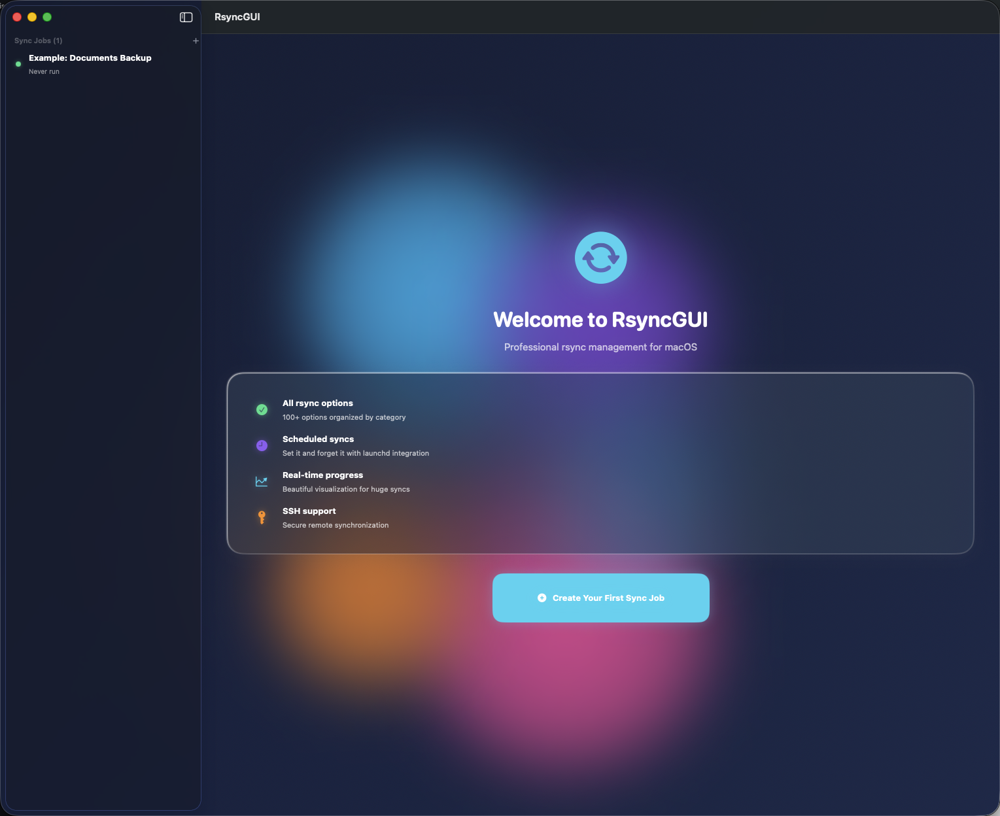

# RsyncGUI


<p align="center">
  
  
  
  
</p>

**A professional macOS GUI for rsync** -- modern, open-source, and built for serious file synchronization. RsyncGUI wraps the full power of rsync behind a glassmorphic SwiftUI interface with real-time progress, AI-powered insights, macOS desktop widgets, automated scheduling via launchd, and a local API server for programmatic control.

A modern replacement for the discontinued [RsyncOSX](https://github.com/rsyncOSX/RsyncOSX).

<p align="center">
  
</p>

---

## Table of Contents

- [Download](#download)
- [Architecture](#architecture)
- [Features](#features)
- [Screenshots](#screenshots)
- [Getting Started](#getting-started)
- [Build from Source](#build-from-source)
- [Nova API Server](#nova-api-server)
- [Security](#security)
- [Project Structure](#project-structure)
- [Configuration Reference](#configuration-reference)
- [Troubleshooting](#troubleshooting)
- [Version History](#version-history)
- [Roadmap](#roadmap)
- [Contributing](#contributing)
- [License](#license)

---

## Download

Download the latest DMG installer from [Releases](https://github.com/kochj23/RsyncGUI/releases/latest), or build from source (see below).

Distributed via DMG -- not the Mac App Store. No sandbox restrictions. Full file system access for unrestricted rsync operation.

---

## Architecture

```
+------------------------------------------------------------------+
|                        RsyncGUI.app                              |
|                                                                  |
|  +---------------------------+  +-----------------------------+  |
|  |      SwiftUI Frontend     |  |     Nova API Server         |  |
|  |                           |  |     (port 37424)            |  |
|  |  ContentView              |  |                             |  |
|  |    +-- JobListView        |  |  GET  /api/status           |  |
|  |    +-- JobDetailView      |  |  GET  /api/jobs             |  |
|  |    +-- JobEditorView      |  |  GET  /api/jobs/:id         |  |
|  |    +-- SyncProgressView   |  |  POST /api/jobs/:id/run     |  |
|  |    +-- AIInsightsView     |  |  POST /api/jobs/:id/dryrun  |  |
|  |    +-- JobHistoryTabView  |  |  GET  /api/history          |  |
|  |    +-- SettingsView       |  |  GET  /api/jobs/:id/history |  |
|  |                           |  |                             |  |
|  +---------------------------+  +-----------------------------+  |
|               |                              |                   |
|  +---------------------------+  +-----------------------------+  |
|  |     Service Layer         |  |      Data Models            |  |
|  |                           |  |                             |  |
|  |  JobManager               |  |  SyncJob                    |  |
|  |    +-- CRUD operations    |  |    +-- sources: [String]    |  |
|  |    +-- Job persistence    |  |    +-- destinations: [Dest] |  |
|  |    +-- Execution dispatch |  |    +-- options: RsyncOptions|  |
|  |                           |  |    +-- schedule: Config     |  |
|  |  RsyncExecutor            |  |    +-- syncMode (fan-out,   |  |
|  |    +-- Process.arguments  |  |    |   fan-in, full-mesh)   |  |
|  |    +-- Real-time parsing  |  |    +-- parallelism config   |  |
|  |    +-- Output cap (10 MB) |  |    +-- pre/post scripts     |  |
|  |    +-- iCloud exclusions  |  |                             |  |
|  |                           |  |  RsyncOptions (100+ flags)  |  |
|  |  AdvancedExecutionService |  |  ScheduleConfig             |  |
|  |    +-- Parallel execution |  |  ExecutionHistory           |  |
|  |    +-- Job dependencies   |  |  DeltaReport                |  |
|  |    +-- Change detection   |  |  ParallelismConfig          |  |
|  |    +-- Delta reporting    |  |                             |  |
|  |                           |  +-----------------------------+  |
|  |  ScheduleManager          |                                   |
|  |    +-- launchd plists     |  +-----------------------------+  |
|  |    +-- load / unload      |  |    External Integrations    |  |
|  |                           |  |                             |  |
|  |  AIInsightsService        |  |  macOS Keychain (SSH creds) |  |
|  |    +-- Error diagnosis    |  |  launchd (scheduling)       |  |
|  |    +-- Anomaly detection  |  |  iCloud Drive (destination) |  |
|  |    +-- Health scoring     |  |  SSH (remote sync)          |  |
|  |    +-- NLP job creation   |  |  WidgetKit (desktop widget) |  |
|  |                           |  |  NWListener (API server)    |  |
|  |  AIBackendManager         |  |                             |  |
|  |    +-- Ollama / MLX       |  +-----------------------------+  |
|  |    +-- TinyLLM / TinyChat |                                   |
|  |    +-- OpenAI / Cloud     |                                   |
|  |    +-- Auto-detect local  |                                   |
|  |                           |                                   |
|  |  WidgetDataSync           |                                   |
|  |    +-- App Group sharing  |                                   |
|  |    +-- WidgetKit refresh  |                                   |
|  |                           |                                   |
|  |  MenuBarManager           |                                   |
|  |    +-- Status bar icon    |                                   |
|  |    +-- Quick job access   |                                   |
|  +---------------------------+                                   |
+------------------------------------------------------------------+
         |                    |                      |
         v                    v                      v
+----------------+  +------------------+  +--------------------+
|   /usr/bin/    |  | ~/Library/       |  | RsyncGUI Widget    |
|   rsync        |  | LaunchAgents/    |  | (WidgetKit ext.)   |
|                |  |                  |  |                    |
| /opt/homebrew/ |  | com.jordankoch.  |  | Small / Medium /   |
|   bin/rsync    |  | rsyncgui.*.plist |  | Large sizes        |
|                |  |                  |  |                    |
| /usr/local/    |  | (auto-generated  |  | Health score,      |
|   bin/rsync    |  |  scheduling)     |  | last sync status,  |
+----------------+  +------------------+  | recent activity    |
                                          +--------------------+

Data flow:

  User creates job          JobManager persists
  in JobEditorView   --->   to ~/Library/Application Support/
         |                  RsyncGUI/jobs.json
         |
         v
  User clicks "Run"        RsyncExecutor spawns
  or schedule fires  --->   /usr/bin/rsync via Process()
         |                  with argument array (no shell)
         |
         v
  Real-time stdout   --->   SyncProgressView renders
  parsing: speed,           animated progress circle,
  ETA, file count           current file, transfer stats
         |
         v
  Execution result   --->   ExecutionHistoryManager logs
  saved to history          WidgetDataSync pushes to widget
         |
         v
  AIInsightsService  --->   Diagnoses errors, detects
  analyzes history          anomalies, scores health,
                            predicts storage needs
```

---

## Features

### Rsync Option Coverage
Over 100 rsync flags organized into intuitive categories: Basic, Transfer, Preserve, Filters, Comparison, Bandwidth, Output, SSH, Ownership, Backup, Logging, Network, I/O, and Checksum. Every option is accessible through a tabbed editor -- no terminal required.

### Real-Time Progress Visualization
Animated progress display built for large syncs (millions of files). Shows transfer speed, ETA, files transferred, bytes moved, and the current file being synced. Gradient effects and smooth animations provide clear visual feedback during long-running operations.

### Multi-Source and Multi-Destination Sync
- **Fan-out (1 to N):** Replicate one source to multiple backup destinations
- **Fan-in (N to 1):** Consolidate multiple sources into a single destination
- **Full Mesh (N to N):** Sync every source to every destination
- **Parallel execution:** Run multiple syncs simultaneously with configurable concurrency
- **Sequential execution:** Run syncs one at a time with optional stop-on-error

### Automated Scheduling via launchd
Native macOS scheduling that runs even when the app is closed. Supports hourly, daily, weekly, monthly, and custom cron frequencies. Generates and manages launchd plists in `~/Library/LaunchAgents/` automatically.

### SSH and Remote Sync
SSH authentication with public key support. Credentials stored securely in macOS Keychain. Supports remote-to-local, local-to-remote syncs with connection testing. SSH key paths validated against traversal attacks.

### iCloud Drive Integration
Sync directly to iCloud Drive as a destination. One-click setup button selects the iCloud Drive root folder. Automatically excludes `.icloud` placeholder files that macOS creates for evicted content. Files sync to all your Apple devices through iCloud.

### AI-Powered Insights
Ten intelligent analysis features powered by local or cloud AI backends:

1. **Smart Error Diagnosis** -- Analyzes rsync errors with actionable fix commands
2. **Change Summary** -- Human-readable summaries of what was synced
3. **Anomaly Detection** -- Flags ransomware patterns, mass deletions, unusual activity
4. **Smart Scheduling** -- Recommends optimal backup times based on history
5. **Storage Prediction** -- Forecasts when destination drives will fill up
6. **Intelligent Exclusions** -- Suggests files to skip (node_modules, DerivedData, etc.)
7. **Natural Language Job Creation** -- Describe a job in plain English to create it
8. **Backup Health Score** -- A through F grade with detailed metrics
9. **Recovery Assistant** -- Search backup history to locate and recover files
10. **Sensitive File Detection** -- Warns about credentials, SSH keys, API keys before syncing

Supports multiple AI backends: Ollama, MLX, TinyLLM, TinyChat, Open WebUI, OpenAI, Google Cloud, Azure, AWS, IBM Watson, or auto-detect local.

### macOS Desktop Widget
WidgetKit extension with three sizes (Small, Medium, Large) for Notification Center. Displays backup health score, last sync status, next scheduled sync, jobs with errors, and recent activity. Auto-refreshes every 15 minutes and after each sync. Tap to open the app.

### Menu Bar Integration
Status bar icon provides quick access to recent jobs, new job creation, and show/hide of the main window without hunting through the Dock.

### Pre/Post Sync Scripts
Run custom scripts before and after sync operations. Scripts receive context via environment variables (JOB_NAME, JOB_STATUS, FILES_TRANSFERRED). Inline shell commands are blocked -- only absolute paths to executable files are accepted.

### Job Dependencies and Conditional Execution
Chain jobs so one must complete successfully before the next starts. Enable change detection to skip syncs when the source has not changed since the last run. Source checksums computed with CryptoKit.

### Delta Reporting
After each sync, view a structured report of what changed: files added, modified, deleted, with byte-level transfer statistics.

### Dry Run Mode
Preview every change rsync would make before executing. See what will be transferred, deleted, or updated with zero risk.

### Nova API Server (Port 37424)
Built-in HTTP API server for programmatic control. Binds to 127.0.0.1 only -- no external network exposure. See the [Nova API Server](#nova-api-server) section for endpoint details.

---

## Screenshots

### Main Window
Glassmorphic dark interface with sidebar navigation, job list, and detail view.

<p align="center">
  
</p>

### Job Editor
Tabbed interface with organized categories: Basic, Transfer, Preserve, Filters, Advanced, and Schedule.

### Progress View
Animated gradient progress circle with real-time speed, ETA, file count, and current file display.

### AI Insights Dashboard
Backup health score, error diagnosis, anomaly alerts, and natural language job creation.

---

## Getting Started

### Installation

1. Download the latest DMG from [Releases](https://github.com/kochj23/RsyncGUI/releases/latest)
2. Open the DMG and drag RsyncGUI.app to your Applications folder
3. Launch RsyncGUI from Applications
4. macOS may prompt for file system permissions on first run -- grant them for full rsync functionality

### Quick Start

1. **Create a job:** Click "+" in the sidebar. Name it, set the source path, set the destination path, and configure rsync options through the tabbed editor.
2. **Dry run first:** Click "Dry Run" to preview what rsync will do. Review the output to confirm it matches your expectations.
3. **Execute:** Click "Run Now" to start the sync. The progress window shows real-time transfer statistics.
4. **Schedule (optional):** Open the Schedule tab in the job editor. Enable scheduling, pick a frequency and time, and save. RsyncGUI creates a launchd plist that runs even when the app is closed.

### Usage Examples

**Daily documents backup:**
```
Name:        Daily Documents Backup
Source:      ~/Documents
Destination: /Volumes/Backup/Documents
Options:     Archive (-a), Delete (--delete), Progress (--progress)
Schedule:    Daily at 2:00 AM
```

**iCloud Drive sync:**
```
Name:        Photos to iCloud
Source:      ~/Pictures/Photos
Destination: iCloud Drive (click the iCloud Drive button)
Options:     Archive (-a), Progress (--progress)
Schedule:    Daily at 11:00 PM
```

**Remote server backup over SSH:**
```
Name:        Web Server Backup
Source:      user@server.com:/var/www/html
Destination: ~/Backups/WebServer
Options:     Archive (-a), Compress (-z), Partial (--partial)
SSH Key:     ~/.ssh/id_rsa
Schedule:    Hourly
```

**Photo archive to NAS:**
```
Name:        Photo Library Sync
Source:      ~/Pictures
Destination: /Volumes/NAS/Photos
Exclude:     *.tmp, .DS_Store, Thumbs.db
Options:     Archive (-a), Stats (--stats)
Schedule:    Weekly (Sunday 3:00 AM)
```

---

## Build from Source

### Requirements

- macOS 14.0+ (Sonoma or later)
- Xcode 15.0+
- Swift 5.9+
- Apple Silicon or Intel Mac

### Steps

```bash
git clone https://github.com/kochj23/RsyncGUI.git
cd RsyncGUI
open RsyncGUI.xcodeproj
```

Build in Xcode with Cmd+B, or from the command line:

```bash
xcodebuild -project RsyncGUI.xcodeproj \
  -scheme RsyncGUI \
  -configuration Release \
  build
```

The app builds without sandbox entitlements (`com.apple.security.app-sandbox = false`) for unrestricted file system access.

---

## Nova API Server

RsyncGUI includes a built-in HTTP API server on port **37424** for integration with [OpenClaw](https://github.com/kochj23) (Nova AI) and Claude Code. The server starts automatically on app launch and binds to `127.0.0.1` only -- no external network exposure.

### Endpoints

| Method | Path | Description |
|--------|------|-------------|
| `GET` | `/api/status` | App status, version, job count, uptime |
| `GET` | `/api/ping` | Health check |
| `GET` | `/api/jobs` | List all sync jobs |
| `GET` | `/api/jobs/:id` | Single job detail |
| `POST` | `/api/jobs/:id/run` | Execute a job |
| `POST` | `/api/jobs/:id/dryrun` | Dry-run a job |
| `GET` | `/api/history` | Recent execution history (last 50) |
| `GET` | `/api/jobs/:id/history` | Execution history for a specific job |

### Example

```bash
# Check app status
curl -s http://127.0.0.1:37424/api/status | python3 -m json.tool

# List all jobs
curl -s http://127.0.0.1:37424/api/jobs | python3 -m json.tool

# Trigger a sync
curl -X POST http://127.0.0.1:37424/api/jobs/<uuid>/run

# Dry-run a sync
curl -X POST http://127.0.0.1:37424/api/jobs/<uuid>/dryrun
```

**Authentication:** None required. The server is loopback-only and inaccessible from the network.

---

## Security

RsyncGUI has undergone a comprehensive security audit (v1.7.0) with 30 findings resolved across critical, high, medium, and low severities.

### Command Execution
- **No shell interpolation.** Rsync commands use `Process.arguments` array, preventing injection via paths or filenames.
- **Shell escaping.** Scheduled commands use single-quote escaping for all arguments in launchd plists.
- **Filter sanitization.** Exclude/include/filter patterns reject control characters to prevent argument injection.
- **Script validation.** Pre/post scripts must be absolute paths to existing executables. Inline shell commands are rejected.
- **Rsync binary resolution.** The binary is resolved from a fixed list (`/usr/bin/rsync`, `/opt/homebrew/bin/rsync`, `/usr/local/bin/rsync`) -- not from user-writable configuration.

### Credential Storage
- SSH credentials stored in macOS Keychain. No plaintext secrets written to disk.
- SSH key paths validated: must be absolute, must exist, no `..` traversal sequences.
- Remote hostname and username validated against `^[a-zA-Z0-9._-]+$` before use.

### Schedule Security
- Launchd plists generated with `PropertyListSerialization` (Apple's API), preventing XML injection.
- No user-supplied values interpolated directly into XML strings.

### Thread Safety
- Widget data sync serialized with a dedicated `DispatchQueue` to prevent race conditions.
- Process handler cleanup reordered to prevent use-after-nil crashes.
- Rsync version detection runs asynchronously off the main thread.

### Input Validation
- Job editor validates source/destination paths before save.
- Job import validates all fields (name, sources, destinations) for empty/whitespace values.
- Numeric fields clamped to prevent negative values.
- Output buffer capped at 10 MB per execution to prevent OOM on large verbose jobs.

### AI Insights Security
- Sensitive file scanner warns about credentials, SSH keys, and API keys before syncing.
- No telemetry or analytics transmitted externally.

---

## Project Structure

```
RsyncGUI/
+-- RsyncGUI.xcodeproj/
+-- RsyncGUI/
|   +-- RsyncGUIApp.swift              App entry point, window setup, API server start
|   +-- NovaAPIServer.swift            HTTP API server (NWListener, port 37424)
|   +-- Info.plist                     Bundle configuration
|   +-- RsyncGUI.entitlements          Entitlements (no sandbox)
|   +-- Design/
|   |   +-- ModernDesign.swift         Glassmorphic theme, colors, glass card modifiers
|   +-- Models/
|   |   +-- SyncJob.swift              Job model: sources, destinations, options, schedule
|   |   +-- RsyncOptions.swift         100+ rsync flags with argument generation
|   |   +-- ScheduleConfig.swift       Schedule model with launchd plist generation
|   |   +-- ExecutionHistory.swift     Execution result and history management
|   |   +-- DeltaReport.swift          Change delta reporting model
|   |   +-- ParallelismConfig.swift    Parallel execution configuration
|   |   +-- ConnectionTest.swift       SSH connection test model
|   +-- Services/
|   |   +-- JobManager.swift           Job CRUD, persistence, execution dispatch
|   |   +-- RsyncExecutor.swift        Process execution, real-time progress parsing
|   |   +-- AdvancedExecutionService.swift  Parallel sync, dependencies, change detection
|   |   +-- ScheduleManager.swift      launchd plist generation and management
|   |   +-- AIInsightsService.swift    10 AI analysis features
|   |   +-- AIBackendManager.swift     Multi-backend AI provider management
|   |   +-- AIBackendManager+Enhanced.swift  Extended AI backend capabilities
|   |   +-- AIBackendStatusMenu.swift  AI backend status UI
|   |   +-- WidgetDataSync.swift       App Group data sharing with widget
|   |   +-- MenuBarManager.swift       Status bar menu integration
|   +-- Views/
|   |   +-- ContentView.swift          Main container with NavigationSplitView
|   |   +-- JobListView.swift          Sidebar job list
|   |   +-- JobDetailView.swift        Job detail display with actions
|   |   +-- JobEditorView.swift        Comprehensive tabbed job editor
|   |   +-- SyncProgressView.swift     Animated real-time progress display
|   |   +-- AIInsightsView.swift       AI insights dashboard
|   |   +-- JobHistoryTabView.swift    Execution history browser
|   |   +-- ExecutionHistoryView.swift Detailed execution result view
|   |   +-- DeltaReportView.swift      Change delta visualization
|   |   +-- SettingsView.swift         App preferences
|   |   +-- TestProgressView.swift     Progress testing utility
|   +-- Resources/
|       +-- Assets.xcassets/           App icon and image assets
+-- RsyncGUI Widget/
|   +-- RsyncGUIWidget.swift           WidgetKit extension (Small/Medium/Large)
|   +-- SharedDataManager.swift        Shared data access for widget
|   +-- WidgetData.swift               Widget data models
+-- Screenshots/
+-- .github/                           CI/CD, issue templates, Dependabot
+-- LICENSE                            MIT License
```

---

## Configuration Reference

### Rsync Option Categories

**Basic:** Archive, Verbose, Compress, Delete, Dry Run, Progress, Stats

**Transfer:** Recursive, Update, Existing, Ignore Existing, Remove Source Files, Partial, In-place, various delete timing modes (before, during, delay, after)

**Preserve:** Permissions, Owner, Group, Times, Devices, Specials, Symlinks, Hard Links, ACLs, Extended Attributes, Executability

**Filters:** Exclude/Include patterns, Exclude-from/Include-from files, CVS exclusions, custom filter rules

**Comparison:** Ignore Time, Size Only, Checksum, Fuzzy matching

**Bandwidth and Performance:** Bandwidth limit (KB/s), I/O timeout, block size, whole-file mode

**Output:** Quiet, Itemize changes, custom output format, human-readable sizes

**SSH and Remote:** Remote shell path, remote rsync path, custom port

**Ownership:** chmod, owner, group, fake-super for non-root privilege preservation

**Backup:** Backup mode, backup directory, backup suffix

**Network:** Connection timeout, bind address, IPv4/IPv6 preference, socket options

**Advanced I/O:** No implied dirs, direct I/O, non-blocking I/O, output buffering

**Checksum:** Algorithm selection, file list checksums

**Logging:** Log file path, log format, info/debug verbosity flags

### Schedule Frequencies

| Frequency | Behavior |
|-----------|----------|
| Hourly | Runs at minute 0 of every hour |
| Daily | Runs at the specified time every day |
| Weekly | Runs on the specified day at the specified time |
| Monthly | Runs on the specified day of month at the specified time |
| Custom | User-defined cron expression |

### Sync Modes

| Mode | Description |
|------|-------------|
| Fan-out (1 to N) | One source replicated to multiple destinations |
| Fan-in (N to 1) | Multiple sources consolidated to one destination |
| Full Mesh (N to N) | Every source synced to every destination |

### Data Storage

- **Jobs:** `~/Library/Application Support/RsyncGUI/jobs.json`
- **Logs:** `~/Library/Application Support/RsyncGUI/Logs/`
- **Schedules:** `~/Library/LaunchAgents/com.jordankoch.rsyncgui.*.plist`
- **Widget data:** Shared via App Group (`group.com.jkoch.rsyncgui`)

---

## Troubleshooting

### Jobs Not Running on Schedule
1. Verify the schedule is enabled in the job editor's Schedule tab
2. Confirm the job is enabled (green indicator in sidebar)
3. Check Console.app for launchd errors
4. Look for the plist in `~/Library/LaunchAgents/`
5. Run `launchctl list | grep rsyncgui` to confirm the job is loaded

### SSH Connection Failures
1. Test SSH manually: `ssh user@host`
2. Verify the SSH key path is correct and the file exists
3. Ensure key permissions are correct: `chmod 600 ~/.ssh/id_rsa`
4. Check `~/.ssh/known_hosts` for the host entry
5. If the host key changed, remove the old entry: `ssh-keygen -R hostname`

### Large Jobs Dying or Running Out of Memory
- RsyncGUI caps output at 10 MB per execution. Full output is available in Console.app.
- Verbose and Compress default to off. Enable only when needed.
- Parallel mode caps file lists at 50,000 entries to prevent RAM exhaustion.
- Directory change detection caps at 100,000 files with cooperative yielding.

### Slow Local Sync Performance
1. Disable compression (-z) -- it burns CPU on local/LAN transfers
2. Enable whole-file mode (-W) for local syncs (skips delta algorithm)
3. Reduce or remove bandwidth limits
4. Increase block size for large files

### Permission Errors
1. Check source/destination ownership: `ls -la /path/to/files`
2. For owner/group preservation, you may need sudo
3. Use `--fake-super` for non-root privilege preservation via extended attributes

### iCloud Drive Issues
- RsyncGUI automatically adds `--exclude=*.icloud` for iCloud destinations to skip evicted file placeholders
- Ensure iCloud Drive is enabled in System Settings before selecting it as a destination
- The iCloud path is: `~/Library/Mobile Documents/com~apple~CloudDocs/`

---

## Version History

| Version | Date | Highlights |
|---------|------|------------|
| **v1.7.3** | March 2026 | SMB/USB destination picker fix, external path validation fix, log folder creation |
| **v1.7.2** | March 2026 | Large job stability (10 MB output cap), iCloud `.icloud` exclusion, async script execution |
| **v1.7.1** | March 2026 | Shell injection blocked in pre/post scripts, rsync binary hardcoded, SSH key/host validation |
| **v1.7.0** | February 2026 | Security audit: 30 findings resolved (3 critical, 8 high). Command injection, XML injection, thread safety |
| **v1.6.0** | February 2026 | macOS Desktop Widget (WidgetKit, 3 sizes), backup health visualization |
| **v1.5.0** | February 2026 | AI Insights (10 features), multi-source/destination, parallel execution, pre/post scripts |
| **v1.1.0** | January 2026 | iCloud Drive integration, one-click setup, path validation |
| **v1.0.0** | January 2026 | Initial release. 100+ rsync options, launchd scheduling, SSH support, progress visualization |

---

## Roadmap

### Completed
- [x] Execution history viewer
- [x] Pre/post sync hook scripts
- [x] Multi-job parallel execution
- [x] AI-powered insights (10 features)
- [x] macOS desktop widget
- [x] Security hardening audit
- [x] iCloud Drive integration
- [x] Nova API server

### Planned
- [ ] Job templates library
- [ ] Email notifications on sync completion/failure
- [ ] Bandwidth usage graphs
- [ ] Conflict resolution UI
- [ ] Menu bar app mode (run without Dock icon)
- [ ] iCloud job sync across Macs

---

## Contributing

Contributions are welcome. Please open an issue for bugs or feature requests, or submit a pull request.

1. Fork the repository
2. Create a feature branch (`git checkout -b feature/your-feature`)
3. Make your changes and test thoroughly
4. Submit a pull request

---

## Technical Details

| Detail | Value |
|--------|-------|
| Language | Swift 5.9 |
| UI Framework | SwiftUI |
| Minimum macOS | 14.0 (Sonoma) |
| Architecture | Native Apple Silicon + Intel (Universal) |
| Sandbox | Disabled (full file system access) |
| Distribution | DMG installer |
| Scheduling | launchd (native macOS) |
| API Server | NWListener (Network framework), port 37424, loopback only |
| AI Integration | NaturalLanguage framework + configurable LLM backends |
| Widget | WidgetKit extension (Small, Medium, Large) |
| Credential Storage | macOS Keychain (Security framework) |
| Persistence | JSON files in Application Support |
| Process Execution | Foundation Process with argument array (no shell) |

---

## License

MIT License

Copyright (c) 2026 Jordan Koch

Permission is hereby granted, free of charge, to any person obtaining a copy
of this software and associated documentation files (the "Software"), to deal
in the Software without restriction, including without limitation the rights
to use, copy, modify, merge, publish, distribute, sublicense, and/or sell
copies of the Software, and to permit persons to whom the Software is
furnished to do so, subject to the following conditions:

The above copyright notice and this permission notice shall be included in all
copies or substantial portions of the Software.

THE SOFTWARE IS PROVIDED "AS IS", WITHOUT WARRANTY OF ANY KIND, EXPRESS OR
IMPLIED, INCLUDING BUT NOT LIMITED TO THE WARRANTIES OF MERCHANTABILITY,
FITNESS FOR A PARTICULAR PURPOSE AND NONINFRINGEMENT. IN NO EVENT SHALL THE
AUTHORS OR COPYRIGHT HOLDERS BE LIABLE FOR ANY CLAIM, DAMAGES OR OTHER
LIABILITY, WHETHER IN AN ACTION OF CONTRACT, TORT OR OTHERWISE, ARISING FROM,
OUT OF OR IN CONNECTION WITH THE SOFTWARE OR THE USE OR OTHER DEALINGS IN THE
SOFTWARE.

---

## More Apps by Jordan Koch

| App | Description |
|-----|-------------|
| [MLXCode](https://github.com/kochj23/MLXCode) | Local AI code assistant for macOS |
| [NMAPScanner](https://github.com/kochj23/NMAPScanner) | Network scanner with GUI for macOS |
| [DotSync](https://github.com/kochj23/DotSync) | Configuration file synchronization across machines |
| [TopGUI](https://github.com/kochj23/TopGUI) | macOS system monitor with real-time metrics |
| [ExcelExplorer](https://github.com/kochj23/ExcelExplorer) | Native macOS Excel/CSV file viewer |

> **[View all projects](https://github.com/kochj23?tab=repositories)**

---

Written by Jordan Koch

> Disclaimer: This is a personal project created on my own time. It is not affiliated with, endorsed by, or representative of my employer.
