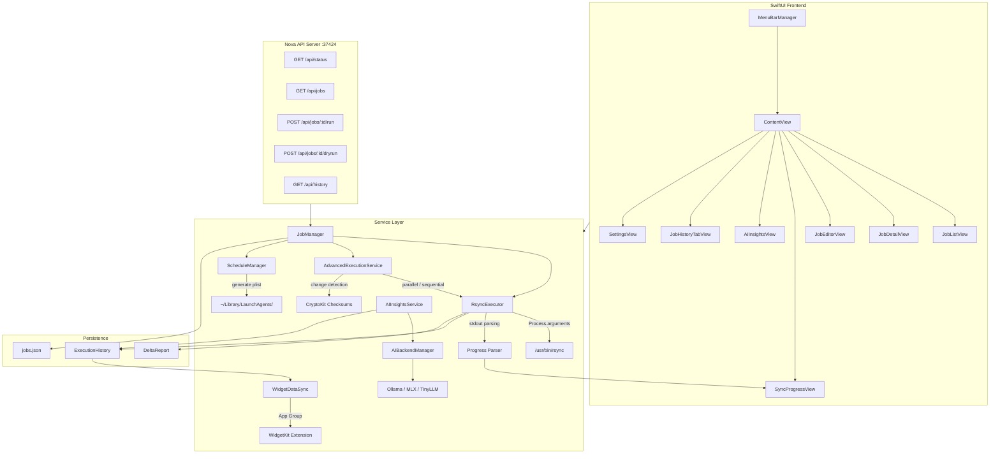

# RsyncGUI

A professional macOS GUI for rsync with real-time progress, AI-powered insights, launchd scheduling, multi-destination sync, desktop widgets, and a local API server.


---

## Features

| Feature | Description |
|---------|-------------|
| 100+ rsync flags | Tabbed visual editor across 14 categories (Basic, Transfer, Preserve, Filters, Comparison, Bandwidth, Output, SSH, Ownership, Backup, Logging, Network, I/O, Checksum) |
| Real-time progress | Animated gradient progress circle with speed, ETA, file count, and current file display |
| Multi-source / multi-destination | Fan-out (1:N), fan-in (N:1), and full mesh (N:N) sync modes with parallel or sequential execution |
| launchd scheduling | Native macOS scheduling (hourly, daily, weekly, monthly, custom cron) that runs even when the app is closed |
| SSH remote sync | Public key authentication with Keychain credential storage, connection testing, and key path validation |
| iCloud Drive sync | One-click iCloud destination setup with automatic `.icloud` placeholder exclusion |
| AI insights (10 features) | Error diagnosis, change summary, anomaly detection, smart scheduling, storage prediction, exclusion suggestions, NLP job creation, health scoring, recovery assistant, sensitive file detection |
| Desktop widget | WidgetKit extension (Small / Medium / Large) showing health score, last sync, next sync, and recent activity |
| Menu bar integration | Status bar icon with quick job access and window toggle |
| Pre/post sync scripts | Run custom scripts with environment variables (JOB_NAME, JOB_STATUS, FILES_TRANSFERRED); only absolute paths accepted |
| Job dependencies | Chain jobs with conditional execution and CryptoKit-based change detection to skip unchanged sources |
| Delta reporting | Structured post-sync report of files added, modified, deleted, with byte-level statistics |
| Dry run mode | Preview all changes before execution |
| Nova API server | HTTP API on port 37424 (loopback only) for programmatic control |

---

## Architecture


```mermaid
graph TD
    subgraph UI["SwiftUI Frontend"]
        CV[ContentView] --> JL[JobListView]
        CV --> JD[JobDetailView]
        CV --> JE[JobEditorView]
        CV --> SP[SyncProgressView]
        CV --> AI[AIInsightsView]
        CV --> HT[JobHistoryTabView]
        CV --> SV[SettingsView]
        MB[MenuBarManager] --> CV
    end

    subgraph Services["Service Layer"]
        JM[JobManager] --> RE[RsyncExecutor]
        JM --> AES[AdvancedExecutionService]
        JM --> SM[ScheduleManager]
        RE -->|Process.arguments| RSYNC["/usr/bin/rsync"]
        RE -->|stdout parsing| PP[Progress Parser]
        AES -->|parallel / sequential| RE
        AES -->|change detection| CD[CryptoKit Checksums]
        SM -->|generate plist| LA["~/Library/LaunchAgents/"]
        AIS[AIInsightsService] --> ABM[AIBackendManager]
        ABM --> OLLAMA["Ollama / MLX / TinyLLM"]
        WDS[WidgetDataSync] -->|App Group| WK[WidgetKit Extension]
    end

    subgraph Data["Persistence"]
        JOBS["jobs.json"]
        HIST["ExecutionHistory"]
        DR["DeltaReport"]
    end

    subgraph API["Nova API Server :37424"]
        STATUS["GET /api/status"]
        GETJOBS["GET /api/jobs"]
        RUN["POST /api/jobs/:id/run"]
        DRYRUN["POST /api/jobs/:id/dryrun"]
        HISTORY["GET /api/history"]
    end

    UI --> Services
    JM --> JOBS
    RE --> HIST
    RE --> DR
    API --> JM
    PP --> SP
    HIST --> WDS
    AIS --> HIST
```

---

## Installation

1. Download the latest DMG from [Releases](https://github.com/kochj23/RsyncGUI/releases/latest)
2. Open the DMG and drag RsyncGUI.app to `/Applications`
3. No sandbox -- full file system access for unrestricted rsync operation

## Requirements

| Requirement | Minimum |
|-------------|---------|
| macOS | 14.0 (Sonoma) |
| Architecture | Universal (Apple Silicon + Intel) |
| rsync | Bundled with macOS; Homebrew version also supported |
| AI features (optional) | Ollama, MLX, TinyLLM, or any supported backend |

---

## Building

```bash
git clone https://github.com/kochj23/RsyncGUI.git
cd RsyncGUI
xcodebuild -project RsyncGUI.xcodeproj -scheme RsyncGUI -configuration Release build
```

## Testing

```bash
xcodebuild -project RsyncGUI.xcodeproj -scheme RsyncGUI -destination 'platform=macOS' test
```

379 tests across 15 test classes:

| Test Class | Tests | Category |
|------------|------:|----------|
| RsyncOptionsTests | 57 | Unit -- argument generation for 100+ flags, archive mode, filter sanitization, Codable |
| ProgressParsingTests | 38 | Unit -- speed/time/bytes parsing, final stats extraction, to-check lines |
| SyncJobTests | 29 | Unit -- job init, sync modes, execution strategy, destination types, Codable |
| NovaAPITests | 29 | Functional -- API endpoint routing, response shapes, status payload |
| FrameTests | 28 | Frame -- app launch, view instantiation, widget data models |
| PathValidationTests | 26 | Security -- tilde expansion, iCloud validation, SMB/USB, traversal detection |
| SecurityTests | 25 | Security -- path traversal, credential exposure, filter sanitization, binary resolution |
| ScheduleConfigTests | 24 | Unit -- plist generation, RunAtLoad, idle config, XML injection prevention |
| CommandInjectionTests | 23 | Security -- SSH host/user validation, rsync-path sanitization, shell escaping |
| FunctionalFlowTests | 18 | Functional -- end-to-end job creation, edit, and execution flows |
| WidgetDataTests | 18 | Unit -- widget data encoding, App Group sync, timeline entries |
| DeltaReportTests | 17 | Unit -- report formatting, itemize parsing, mixed change detection |
| ExecutionHistoryTests | 17 | Unit -- history entries, transfer speed calculation, Codable |
| IntegrationTests | 15 | Integration -- rsync binary verification, local sync with temp dirs, dry run, delete, exclude |
| DependencyCheckTests | 15 | Unit -- satisfied/unsatisfied dependencies, missing jobs, parallel file splitting |

---

## Nova API Server

Port **37424** (127.0.0.1 loopback only). No authentication required.

| Method | Path | Description |
|--------|------|-------------|
| `GET` | `/api/status` | App status, version, job count, uptime |
| `GET` | `/api/ping` | Health check |
| `GET` | `/api/jobs` | List all sync jobs |
| `GET` | `/api/jobs/:id` | Single job detail |
| `POST` | `/api/jobs/:id/run` | Execute a job |
| `POST` | `/api/jobs/:id/dryrun` | Dry-run a job |
| `GET` | `/api/history` | Recent execution history |
| `GET` | `/api/jobs/:id/history` | History for a specific job |

```bash
curl -s http://127.0.0.1:37424/api/status | python3 -m json.tool
curl -X POST http://127.0.0.1:37424/api/jobs/<uuid>/run
```

---

## License

MIT License -- Copyright (c) 2026 Jordan Koch

See [LICENSE](LICENSE) for the full text.

---

Written by Jordan Koch
